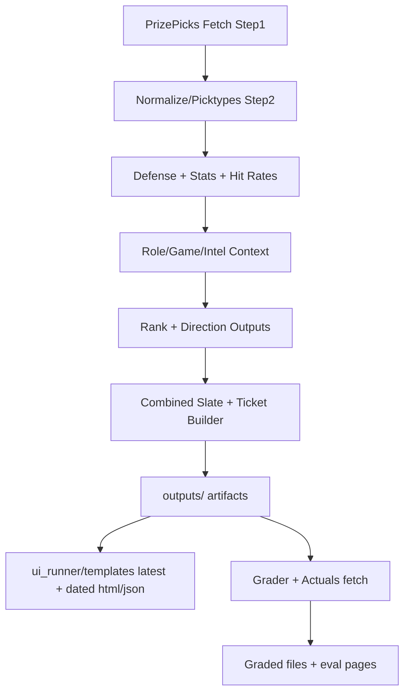

# PropORACLE System Deep Dive and Status Tracker

Last updated: 2026-03-27
Source of truth for this document: current scripts, run commands, and repository state.

## 1) What this app is

PropORACLE is a multi-sport prop pipeline platform that:
- pulls daily prop slates (primarily from PrizePicks),
- enriches those slates with stats/context signals,
- ranks and directions props,
- builds combined tickets across sports,
- grades outcomes after games complete,
- and publishes web-ready artifacts for UI consumption.

The system is batch-first (PowerShell + Python), with the UI fed from generated files in `ui_runner/templates`.

## 2) Core architecture

### Orchestration layer
- `run_pipeline.ps1`: master pipeline for daily slate generation, sport-specific runs, combined run, and template publishing.
- `scripts/run_daily.ps1`: higher-level daily operator (historical fetch, grading, consistency, pipeline, combined build, optional push/retrain).
- `scripts/run_grader.ps1`: grades yesterday (or specific date), builds eval outputs, and updates HTML artifacts.

### Sport pipelines
- NBA: deepest pipeline (steps 1-8 plus sub-steps 6a-6e context/intel layers).
- CBB/WCBB: pipeline through ranked outputs (step6).
- NHL/Soccer/MLB/WNBA: similar stepwise enrich -> rank -> direction flows with sport-specific variations.
- NBA1H/NBA1Q: period-specific branches integrated in command config and grading flow.
  - Current implementation detail: these branches are orchestrated via `ui_runner/commands.json` and currently reuse shared NBA step scripts with period-specific `league_id`, input, and output file names; they are not yet implemented as separate dedicated script trees.

### Data/model layer
- Outputs are date-scoped under `outputs/<date>/`.
- Intermediate sport outputs live under each sport folder (`NBA/data/outputs`, `Soccer/outputs`, etc.).
- Cached data is used heavily (`data/cache`, sport cache files, JSON/CSV caches).
- ML models are trained by scripts in `scripts/train_prop_model_*.py`; presence checks happen in the pipeline.

### Presentation layer
- `scripts/combined_slate_tickets.py` builds combined slate/tickets and writes "latest" web files.
- UI templates are generated into `ui_runner/templates` (dated and latest files).
- Eval builders (`build_ticket_eval.py`, grader HTML builders) produce scoreboard/evaluation pages.

## 3) End-to-end daily flow (current behavior)

1. Optional pre-refresh of historical/actual data.
2. Grade yesterday's outputs and refresh consistency data.
3. Run today's pipelines (parallel full run, or sport-specific).
4. Build combined tickets from available sport outputs.
5. Write dated output artifacts + latest UI template files.
6. Optionally commit/push and optionally retrain models.

## 4) System flow diagram

## 5) Critical dependencies

| Component | Current usage | Failure impact | Mitigation |
|---|---|---|---|
| Python runtime | Scripts assume `py -3.14` in many paths | Pipeline/grade can fail immediately | Add preflight version check + fallback |
| PrizePicks API availability | Step1 fetch for each sport | Missing/partial slate inputs | `-SkipFetch` fallback to previous outputs |
| Odds API key | NBA game context (step6b) | Reduced context quality / failure of context step | Use env-only secrets + explicit validation |
| ESPN/cache files | Step4 stats + ID maps | Missing stats, weaker model/ranking signal | Cache refresh + health checks |
| Local file system consistency | Multiple output/copy paths | Stale file reuse, wrong combine inputs | Path normalization + canonical outputs |
| Git/network (optional) | Auto commit/push in run scripts | Unintended changes or failed automation | Disable by default; explicit opt-in |

## 6) Current completion status

## Complete / Operating

- Multi-sport architecture is implemented and runnable from root orchestration scripts.
- Date-aware output archiving exists (`outputs/<date>/...`) and is used by both pipeline and grader flows.
- Combined ticket generation is integrated and supports multi-sport input auto-detection.
- Grading flow supports NBA, CBB, NHL, Soccer, plus NBA period segments (1H/1Q) when files exist.
- Daily automation script (`scripts/run_daily.ps1`) includes logging, staged workflow, and fail/continue behavior.
- Model training scripts and auto-check hooks exist; retrain pathways are wired into run scripts.
- UI artifact generation is connected to pipeline/grader outputs.

## Needs Optimization

- **Config centralization**: hardcoded values (seasons, thresholds, retry params, flags) are spread across scripts; move to a shared config file.
- **Path consistency**: mixed output locations (`root`, `sport root`, `sport outputs`, `date outputs`) increase complexity and accidental stale-file reuse risk.
- **Duplicate orchestration logic**: step chains are repeated in multiple contexts (single-sport and parallel jobs); use shared wrappers or a manifest-driven runner.
- **Observability**: logs are present but fragmented; add one canonical run report with step-level durations, errors, and artifact paths.
- **Dependency/runtime alignment**: scripts heavily assume `py -3.14`; add robust fallback/version checks and a setup verifier.
- **Testing surface**: high script count with low visible test coverage; add smoke/integration tests for critical run paths.

## Needs Serious Attention (High Priority)

- **Secret exposure risk**: `run_pipeline.ps1` currently contains a default Odds API key value in script parameters. Move to environment variables/secrets management immediately.
- **Git side effects in run paths**: pipeline/daily scripts include commit/push actions. This can cause unintended repository mutations during normal runs and should be gated/off by default.
- **Repository hygiene drift**: current state shows duplicate file patterns and path-variant duplicates (forward/backslash versions), tracked output artifacts, and `__pycache__` files. This increases merge risk and operational confusion.
- **Single source of truth drift**: command references and docs indicate multiple historical locations/legacy names; stale references can lead to wrong-file execution.
- **Data integrity risk from synced storage**: notes in scripts already mention lock contention concerns under sync environments (e.g., OneDrive) for database/cache files; consider relocating mutable DB/cache to a non-synced local path.

## 7) Per-sport maturity matrix

Scale: 1 (low) to 5 (high), based on current script depth and integration.

| Sport | Pipeline stability | Grading quality coverage | Model/ranking maturity | Data freshness confidence | Notes |
|---|---:|---:|---:|---:|---|
| NBA | 4 | 4 | 5 | 4 | Most complete context chain (6a-6e), strongest backbone |
| CBB | 3 | 3 | 3 | 3 | Stable core flow, fewer advanced layers than NBA |
| NHL | 3 | 3 | 3 | 3 | End-to-end present; less hardened than NBA |
| Soccer | 3 | 3 | 3 | 3 | Complete path, variance from league/input complexity |
| MLB | 2 | 2 | 2 | 2 | Functional but appears in active migration/hygiene state |
| WNBA | 2 | 2 | 2 | 2 | Seasonal and less integrated in daily default path |
| NBA1H | 3 | 3 | 3 | 3 | Integrated branch with graded outputs when data exists |
| NBA1Q | 3 | 3 | 3 | 3 | Integrated branch with additional period-history support |
| WCBB | 2 | 2 | 2 | 2 | Present but not as mature as main CBB flow |

## 8) SLOs and operational targets

| Metric | Target | Warning threshold | Critical threshold |
|---|---|---|---|
| Full daily run success rate | >= 95% weekly | < 90% | < 80% |
| Full run wall-clock time | <= 45 min | > 60 min | > 90 min |
| Sport run completion | >= 90% of enabled sports | < 80% | < 60% |
| Combined output freshness | same-day file in `outputs/<date>/` | missing by noon local | missing by end of day |
| Grading freshness | yesterday graded by next day noon | delayed > 24h | delayed > 48h |
| Critical script error rate | <= 2 hard failures/day | > 3 | > 5 |

## 9) Incident playbook (quick response)

### A) Step1 fetch failing / no props
- Confirm API availability and network.
- Retry sport-only run first (example: `.\run_pipeline.ps1 -NBAOnly`).
- If urgent, run with `-SkipFetch` and annotate that prior slate source is reused.

### B) Combined output missing
- Verify required upstream artifacts exist (NBA + CBB are mandatory in current combine logic).
- Re-run: `.\run_pipeline.ps1 -CombinedOnly -Date <yyyy-mm-dd>`.
- Check for path mismatch between expected and actual step outputs.

### C) Grader missing outputs
- Ensure date-folder artifacts exist in `outputs/<date>/`.
- Run: `.\scripts\run_grader.ps1 -Date <yyyy-mm-dd>`.
- Confirm actuals fetch files exist (`actuals_*.csv`) and retry grading.

### D) Cache/db lock or corruption symptoms
- Stop concurrent runs and OneDrive sync temporarily.
- Move mutable db/cache to local non-synced path as long-term fix.
- Rebuild cache where supported (`-RefreshCache` or script-level cache rebuild).

### E) Model missing / poor blend coverage
- Run relevant trainer scripts in `scripts/train_prop_model_*.py`.
- Re-run sport pipeline and compare score distribution before/after.

## 10) Recommended remediation plan

### Phase 1 (Immediate: 1-2 days)
- Remove hardcoded API key defaults; load from env only and fail with clear message if missing.
- Disable automatic git push/commit by default in runtime scripts; require explicit opt-in switch.
- Add/update `.gitignore` for `__pycache__`, transient caches, generated xlsx/csv/json outputs that should not be versioned.
- Normalize script path usage (single canonical style and canonical output directories).

### Phase 2 (Short term: 3-7 days)
- Introduce a unified config file (YAML/JSON/TOML) for league IDs, seasons, thresholds, cache settings, and retries.
- Build a lightweight run manifest so each sport flow is declared once and reused by all runners.
- Add a health-check script that validates environment, expected folders/files, model presence, and API key availability before run.

### Phase 3 (Stability hardening: 1-2 weeks)
- Add integration smoke tests for full run, sport-only run, combined-only run, and grader run.
- Add structured run summary output (JSON + human-readable report) for every daily execution.
- Isolate mutable cache/DB artifacts from synced folders and formalize retention/cleanup policy.

## 11) Risk register (owners and due dates)

| Risk | Severity | Owner | Target due date | Status | Notes |
|---|---|---|---|---|---|
| Hardcoded API key in script defaults | Critical | Unassigned | 2026-03-31 | Open | Move to env-only secret handling |
| Auto git push during runtime | High | Unassigned | 2026-04-02 | Open | Add explicit `-EnablePush` gate |
| Output path duplication/stale reuse | High | Unassigned | 2026-04-05 | Open | Consolidate canonical artifact locations |
| Generated/transient files tracked in git | High | Unassigned | 2026-04-01 | Open | `.gitignore` hardening + cleanup |
| Sync-related DB/cache lock risk | Medium | Unassigned | 2026-04-08 | Open | Relocate mutable stores off synced dir |
| Sparse automated run tests | Medium | Unassigned | 2026-04-12 | Open | Add smoke tests for critical run paths |

## 12) "Definition of done" tracking checklist

Use this section to track progress from now forward.

- [ ] Secrets externalized (no default API keys in repo scripts)
- [ ] Auto git push disabled by default and guarded by explicit flag
- [ ] `.gitignore` cleaned for generated/transient artifacts
- [ ] Duplicate path-variant files resolved and consolidated
- [ ] Unified config file adopted by all major runners
- [ ] Unified manifest-based step execution in place
- [ ] Preflight health-check command added and documented
- [ ] Integration smoke tests passing in CI/local
- [ ] Single run report generated for pipeline + grader

## 13) 5-minute post-run verification checklist

- [ ] Confirm `outputs/<date>/combined_slate_tickets_<date>.xlsx` exists and timestamp is current.
- [ ] Confirm sport artifacts expected for today's run exist in `outputs/<date>/`.
- [ ] Confirm `ui_runner/templates/tickets_latest.html` and `tickets_latest.json` updated this run.
- [ ] If grader ran, confirm `outputs/<date>/combined_tickets_graded_<date>.xlsx` exists.
- [ ] Spot-check one sport file for non-empty rows and expected columns.

## 14) Data retention guidance

- Treat `outputs/<date>/` as immutable historical run records.
- Treat root-level temporary combined files as transient and cleanup candidates.
- Treat `__pycache__`, temporary caches, debug dumps, and ad-hoc exports as non-source artifacts.
- Keep only canonical caches required for speed/reproducibility; prune stale snapshots regularly.

## 15) Glossary

- **Direction Context**: layer that converts ranked props into directional recommendation framing.
- **Hit Rate**: historical rate of clearing the posted line under selected window/logic.
- **Intel Layer (NBA step6e)**: additional context enrichment after opponent/game/schedule layers.
- **Tiering (A/B/C/D)**: confidence grouping used during combined ticket construction.
- **Combined Slate**: merged cross-sport candidate set used by ticket builder.
- **Slate Date**: target date for props/context used in that run's artifacts.

## 16) Quick orientation for contributors

- For daily operations: start with `scripts/run_daily.ps1`.
- For direct pipeline control: use `run_pipeline.ps1`.
- For post-game scoring and reports: use `scripts/run_grader.ps1`.
- For UI outputs: inspect `ui_runner/templates` and dated files under `outputs/<date>/`.

## 17) Change log

- 2026-03-27: Initial system deep-dive and status tracker created.
- 2026-03-27: Added diagram, dependencies, maturity matrix, SLO targets, incident playbook, risk register, verification checklist, retention guidance, and glossary.
- 2026-03-27: Clarified NBA1Q/NBA1H architecture as shared-script period pipelines (command-config driven), not separate dedicated script trees yet.

---

If desired, this document can be split next into:
1) `SYSTEM_ARCHITECTURE.md` (how it works),
2) `OPERATIONS_RUNBOOK.md` (how to run/fix),
3) `TECH_DEBT_REGISTER.md` (optimization + serious issues tracker).
