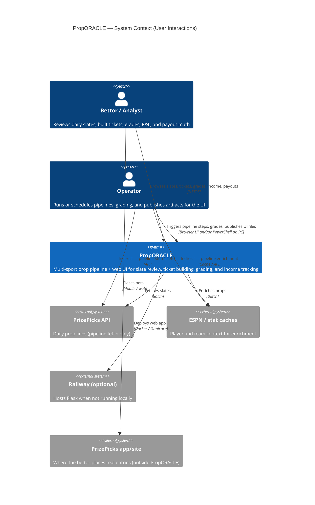
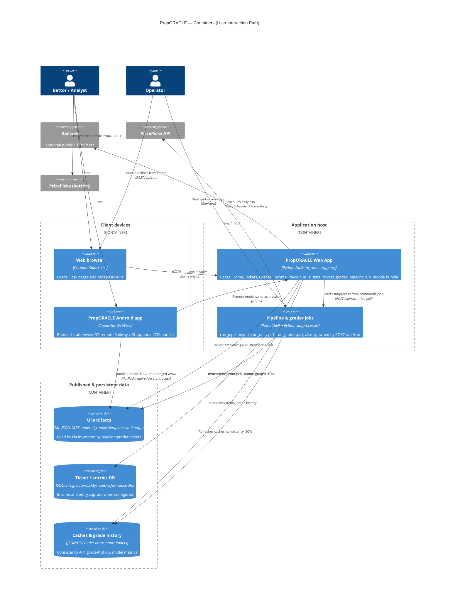
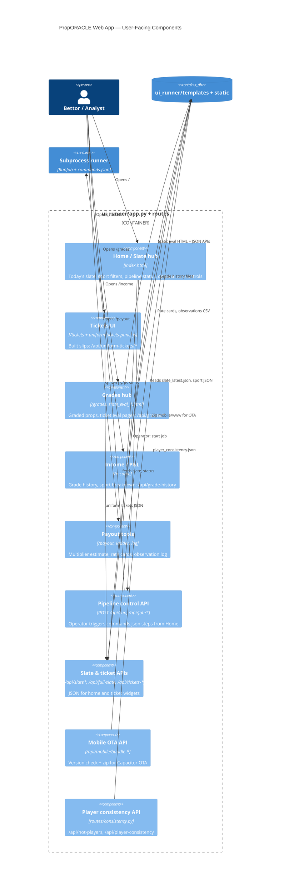
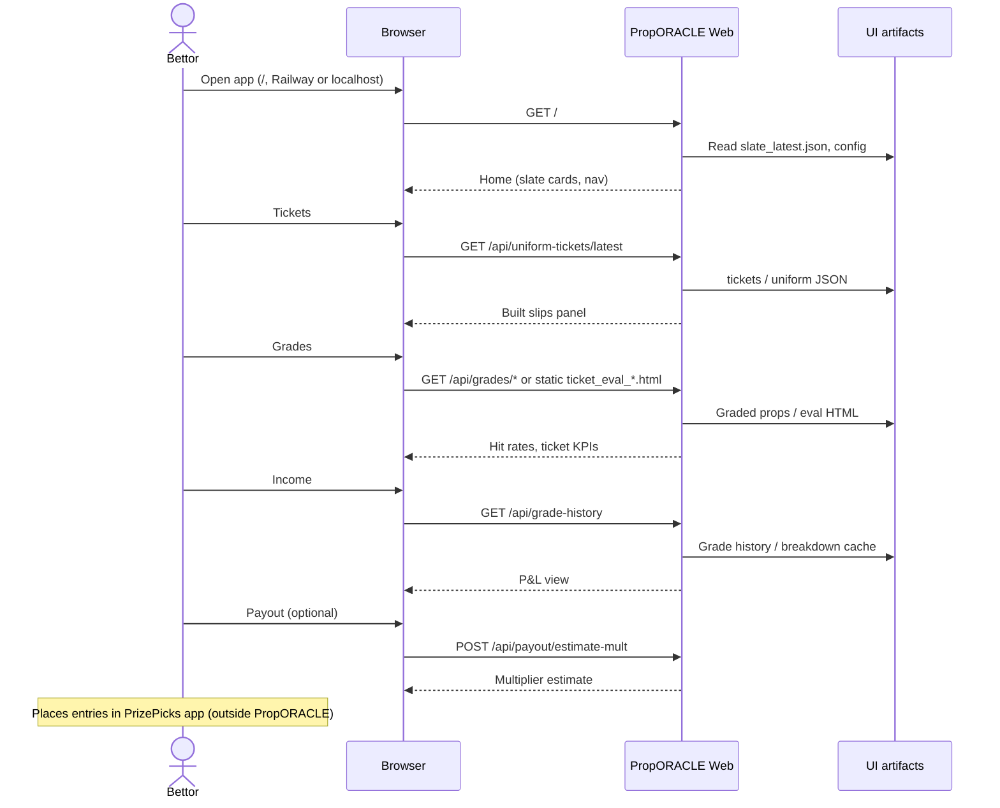
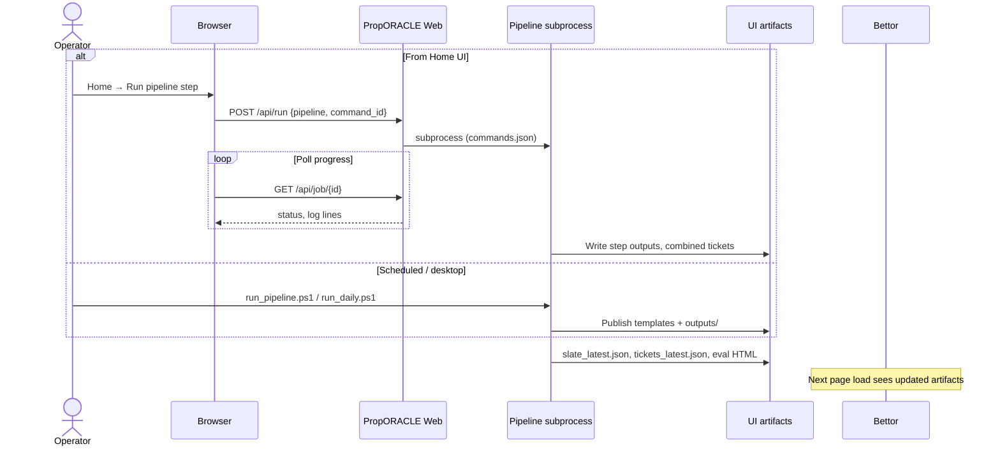

# PropORACLE — C4 diagrams (user interactions)

C4 views of how people interact with PropORACLE: browsing slates and tickets, reviewing grades and income, using payout tools, running pipelines from Home, and using the Android app.

**How to view:** Open this file in Cursor/VS Code Markdown preview, or on GitHub. Diagrams use [Mermaid C4](https://mermaid.js.org/syntax/c4.html).

---

## Level 1 — System context

Who touches the system and what they care about. External APIs (PrizePicks, ESPN) are pipeline inputs; bettors do not call them directly.



---

## Level 2 — Container diagram

Runtime pieces involved in **user-visible** behavior (not every script in `scripts/`).



---

## Level 3 — Web app components (user-facing)

Inside the Flask container: main surfaces a user navigates via `_site_nav.html` (Home · Tickets · Grades · Income · Payouts).



---

## User journeys (dynamic)

Typical **bettor** session vs **operator** workflow.

### Bettor — review and decide (no pipeline write)



### Operator — refresh slate for everyone



### Mobile — bundled vs remote

```mermaid
flowchart LR
    subgraph bundled["Bundled APK (default)"]
        M1[Capacitor WebView] --> W1[mobile/www static HTML]
        W1 -.optional.-> API1[LAN/Railway Flask APIs]
    end

    subgraph remote["Remote mode (sync:url)"]
        M2[Capacitor WebView] --> F2[Railway Flask]
        F2 --> W2[Same pages as browser]
    end

    subgraph ota["OTA update (remote host)"]
        M3[proporacle-ota.js] --> V[/api/mobile/bundle-version]
        V --> Z[/api/mobile/bundle.zip]
        Z --> W3[Refresh mobile/www in WebView storage]
    end
```

---

## Interaction map (pages → APIs)

Quick reference for the main nav tabs (see `ui_runner/templates/_site_nav.html`).

| User goal | Page | Primary APIs / assets |
|-----------|------|------------------------|
| See today's slate & model context | `/` Home | `/api/slate`, `/api/full-slate`, `/api/slate-display-date`, `/api/pipeline/status`, `/api/hot-players` |
| Review built tickets | `/tickets` | `/api/uniform-tickets/latest`, `/api/uniform-tickets/<date>` |
| Check results & eval | `/grades` | `/api/graded-props`, `/api/grades/*`, `slate_eval_<date>.html`, `ticket_eval_<date>.html` |
| Track P&L | `/income` | `/api/grade-history` |
| Payout math & logging | `/payout` | `/api/payout/estimate-mult`, `/api/payout/rate-cards`, POST log endpoints |
| Run pipeline (operator) | Home controls | `POST /api/run`, `GET /api/job/<id>`, `GET /api/jobs` |
| Mobile offline UI | Capacitor `www/` | Static HTML; OTA: `/api/mobile/bundle-version`, `bundle.zip` |

---

## Related docs

- [USE_CASE_DIAGRAM.md](USE_CASE_DIAGRAM.md) — **UML use case diagram** (PlantUML + catalog)
- [PROJECT_LAYOUT.md](PROJECT_LAYOUT.md) — folder contracts
- [guides/APP_SYSTEM_STATUS.md](guides/APP_SYSTEM_STATUS.md) — pipeline flow (batch-centric)
- [mobile/README.md](../mobile/README.md) — bundled vs remote Android
