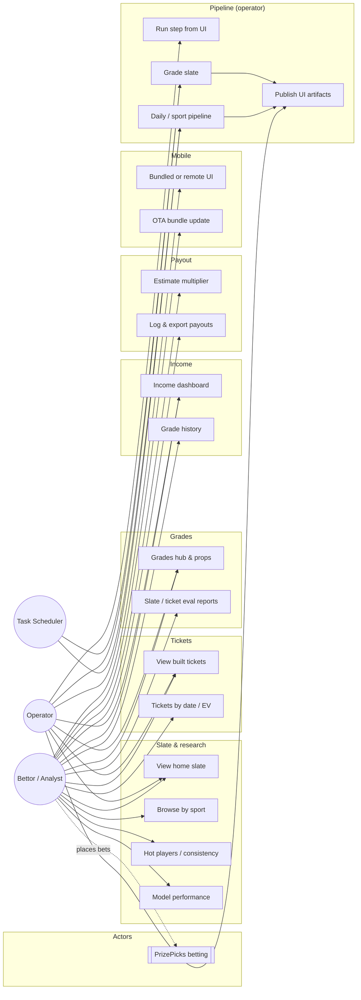

# PropORACLE — UML use case diagram

Standard UML use case view of what **Bettor/Analyst**, **Operator**, and **Task Scheduler** can do with PropORACLE.

---

## Diagram (PlantUML)

Source file: [`diagrams/proporacle-use-cases.puml`](diagrams/proporacle-use-cases.puml)

**Render locally**

- VS Code / Cursor: install **PlantUML** extension, open the `.puml` file, run preview.
- CLI: `java -jar plantuml.jar docs/diagrams/proporacle-use-cases.puml`
- Online: paste file contents into [plantuml.com](https://www.plantuml.com/plantuml/uml/)

```plantuml
@startuml
!include docs/diagrams/proporacle-use-cases.puml
@enduml
```

For a self-contained copy, open `diagrams/proporacle-use-cases.puml` directly (recommended).

---

## Simplified view (Mermaid)

GitHub/Cursor Markdown preview does not render PlantUML by default. This is a **readable approximation** (not strict UML notation).



---

## Actors

| Actor | Type | Description |
|-------|------|-------------|
| **Bettor / Analyst** | Primary human | Consumes slates, tickets, grades, income, payouts; may use web or Android app |
| **Operator** | Primary human | Runs pipelines, grading, publishing; may also browse like a bettor |
| **Task Scheduler** | System | Windows scheduled task running `run_daily.ps1` / `run_pipeline.ps1` |
| **PrizePicks (betting site)** | External | Where real entries are placed — **outside** PropORACLE boundary |

---

## Use case catalog

### Slate & research

| ID | Use case | Actor | UI / API |
|----|----------|-------|----------|
| UC-HOME | View home slate | Bettor | `/`, `/api/slate`, `/api/full-slate` |
| UC-SPORT | Browse slate by sport | Bettor | `/api/slate-sport/<sport>` |
| UC-CONS | View hot players & consistency | Bettor | `/api/hot-players`, `/api/player-consistency` |
| UC-MODEL | View model performance | Bettor | `/api/model-performance` |
| UC-XLS | Export slate (Excel) | Bettor | `/api/slate-excel` |

### Tickets

| ID | Use case | Actor | UI / API |
|----|----------|-------|----------|
| UC-TIX-L | View built tickets (latest) | Bettor | `/tickets`, `/api/uniform-tickets/latest` |
| UC-TIX-D | Browse tickets by date | Bettor | `/api/uniform-tickets/<date>` |
| UC-TIX-EV | View ticket EV & win-rate | Bettor | `/api/ticket-ev-summary`, `/api/tickets/winrate` |
| UC-TIX-BT | View ticket backtest | Bettor | `/api/uniform-tickets/backtest` |

### Grades & evaluation

| ID | Use case | Actor | UI / API |
|----|----------|-------|----------|
| UC-GR-H | Open grades hub | Bettor | `/grades`, `/grades/hub` |
| UC-GR-P | Browse graded props | Bettor | `/api/graded-props`, `/api/grades/props` |
| UC-GR-SE | Open slate evaluation report | Bettor | `/grades/slate_eval_<date>.html` |
| UC-GR-TE | Open ticket evaluation report | Bettor | `/grades/ticket_eval_<date>.html` |

### Income & tracking

| ID | Use case | Actor | UI / API |
|----|----------|-------|----------|
| UC-INC | View income / P&L dashboard | Bettor | `/income` |
| UC-GH | View grade history | Bettor | `/api/grade-history` |

### Payout tools

| ID | Use case | Actor | UI / API |
|----|----------|-------|----------|
| UC-PAY-E | Estimate payout multiplier | Bettor | `/payout`, `POST /api/payout/estimate-mult` |
| UC-PAY-R | View rate cards & combo table | Bettor | `/api/payout/rate-cards`, `/api/payout/combo-table` |
| UC-PAY-L | Log payout observation | Bettor | `POST /api/payout/log-observation` |
| UC-PAY-X | View ladder / examples / export | Bettor | `/payout/ladder`, export endpoints |

### Mobile app

| ID | Use case | Actor | Notes |
|----|----------|-------|-------|
| UC-MOB-B | Use bundled offline UI | Bettor | `mobile/www/` in APK |
| UC-MOB-R | Use remote web in shell | Bettor | Capacitor → Railway Flask |
| UC-MOB-O | Check & apply OTA update | Bettor | `/api/mobile/bundle-version`, `bundle.zip` |

### Pipeline & operations

| ID | Use case | Actor | Trigger |
|----|----------|-------|---------|
| UC-RUN-UI | Run pipeline step from Home | Operator | `POST /api/run` |
| UC-JOB | Monitor pipeline job | Operator | `GET /api/job/<id>` |
| UC-STAT | Check pipeline status | Operator | `/api/pipeline/status` |
| UC-DAILY | Run daily pipeline | Operator, Scheduler | `scripts/run_daily.ps1` |
| UC-SPORT | Run sport pipeline | Operator, Scheduler | `run_pipeline.ps1` |
| UC-GRADE | Grade completed slate | Operator, Scheduler | `scripts/run_grader.ps1` |
| UC-PUB | Publish UI artifacts | Operator | Writes `ui_runner/templates/*` |
| UC-FETCH | Fetch PrizePicks slate | System (included) | Pipeline step 1 |
| UC-ENRICH | Enrich & rank props | System (included) | Sport steps |
| UC-COMB | Build combined tickets | System (included) | `combined_slate_tickets.py` |

### General UI

| ID | Use case | Actor | UI / API |
|----|----------|-------|----------|
| UC-THEME | Toggle light/dark theme | Bettor | Client `localStorage` |
| UC-HEALTH | Verify deploy / health | Bettor, Operator | `/ping`, `/api/build` |

---

## Relationships (UML)

| Type | From | To | Meaning |
|------|------|-----|---------|
| **Association** | Actor | Use case | Actor performs the use case |
| **Include** | Run daily pipeline | Run sport pipeline | Daily run always runs sport pipelines |
| **Include** | Run sport pipeline | Fetch / Enrich / Combine | Standard pipeline chain |
| **Include** | Run step from UI | Monitor job | UI run returns `job_id` to poll |
| **Include** | Grade slate | Publish artifacts | Grader writes eval HTML/JSON |
| **Extend** | OTA update | Verify deploy | Optional check before downloading bundle |

---

## Related docs

- [ARCHITECTURE_USER_INTERACTIONS.md](ARCHITECTURE_USER_INTERACTIONS.md) — C4 context, containers, sequences
- [PROJECT_LAYOUT.md](PROJECT_LAYOUT.md) — repo folders
- [guides/APP_SYSTEM_STATUS.md](guides/APP_SYSTEM_STATUS.md) — batch pipeline flow
