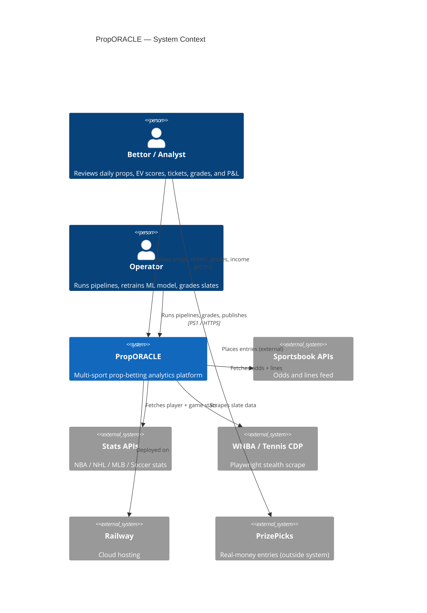
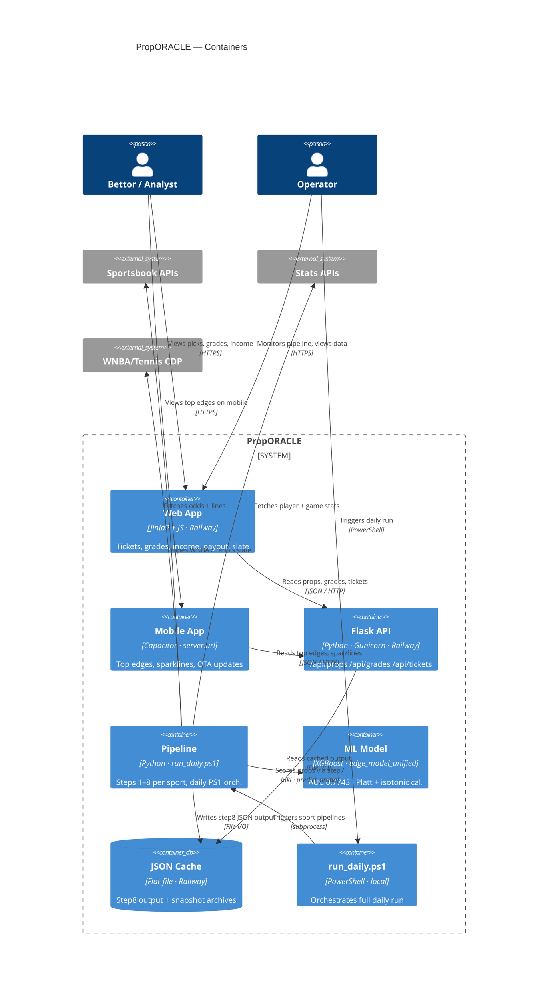
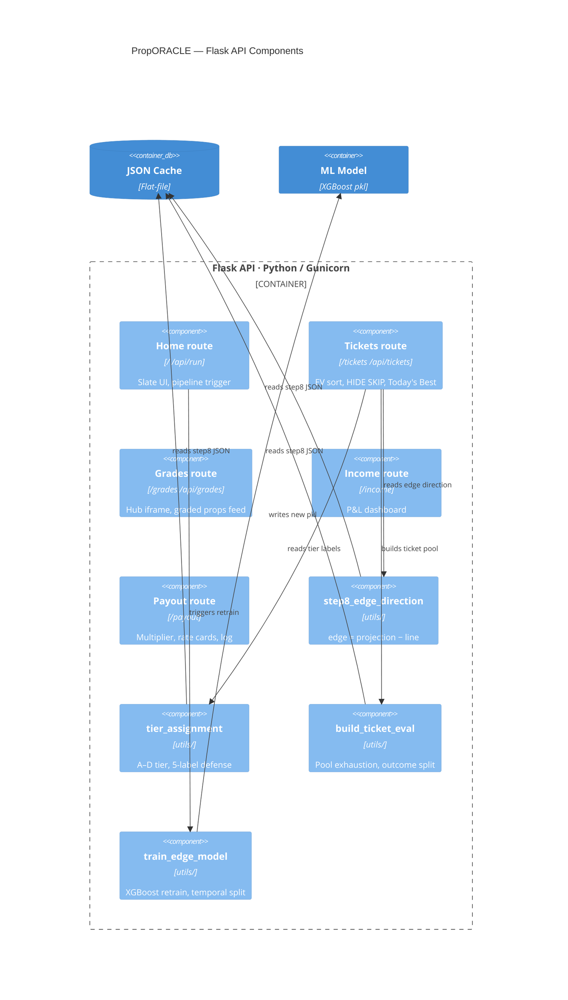

# PropORACLE — Architecture & User Interactions

> **Diagrams in this doc** render natively in GitHub, GitLab, and Cursor's Markdown preview (Mermaid support built-in). For full UML notation (ovals, stick figures, `<<include>>`), open the `.puml` files in `docs/diagrams/` with the PlantUML extension or paste into [plantuml.com](https://www.plantuml.com/plantuml).

---

## Table of contents

1. [C4 Level 1 — System context](#c4-level-1--system-context)
2. [C4 Level 2 — Containers](#c4-level-2--containers)
3. [C4 Level 3 — Flask API components](#c4-level-3--flask-api-components)
4. [Use case summary](#use-case-summary)
5. [Sport pipeline coverage](#sport-pipeline-coverage)
6. [Related files](#related-files)

---

## C4 Level 1 — System context

Who uses PropORACLE and what external systems it depends on.



---

## C4 Level 2 — Containers

Which container each user touches and how data flows through the system.



---

## C4 Level 3 — Flask API components

Internal structure of the Flask API container.



---

## Use case summary

### Actors

| Actor | Type | Description |
|---|---|---|
| Bettor / Analyst | Person | Primary consumer — browses slate, tickets, grades, income, payout tools, and mobile app |
| Operator | Person | Runs pipelines, grades slates, retrains model, publishes artifacts; also browses as Bettor |
| Task Scheduler | System actor | Automated — triggers `run_daily.ps1` and grader on schedule |
| PrizePicks | External | Real-money entries happen here; PropORACLE only supports research and ticket building |

### Use case packages

| Package | Use cases |
|---|---|
| **Slate & research** | View home slate, browse by sport, hot players / consistency, model performance, export Excel |
| **Tickets** | Latest tickets, by date, EV & win-rate summaries, ticket backtest |
| **Grades & evaluation** | Grades hub, browse graded props, slate eval report, ticket eval report |
| **Income & tracking** | Income / P&L dashboard, grade history & sport breakdown |
| **Payout tools** | Estimate multiplier, rate cards & combo table, log observation, payout ladder, export logs |
| **Mobile app** | Bundled offline UI, remote web UI in app shell, OTA bundle update |
| **Pipeline & ops** | Run step from UI, monitor job, pipeline status, daily pipeline, sport pipeline, grade slate, publish artifacts |

### Key `<<include>>` relationships

```
Run daily pipeline  ──includes──►  Run sport pipeline
Run sport pipeline  ──includes──►  Fetch PrizePicks slate
Run sport pipeline  ──includes──►  Enrich & rank props
Run sport pipeline  ──includes──►  Build combined tickets
Run daily pipeline  ──includes──►  Publish UI artifacts
Grade completed slate ─includes──► Publish UI artifacts
Run pipeline step (UI) ─includes─► Monitor pipeline job
OTA bundle update   ──extends───►  Verify deploy / health
```

---

## Sport pipeline coverage

| Sport | AUC (2026-05-25) | Step8 join rate | Notes |
|---|---|---|---|
| MLB | 0.7268 | ~99.1% | Strong — name_aliases fix resolved join rate |
| NBA | 0.6175 | — | Watch |
| NBA1H | 0.4511 | — | ⚠ Below random on May slice — suppress or investigate |
| NHL | 0.6905 | ~38% | ⚠ Low join rate — backfill 13 dates (Feb/Mar) |
| Soccer | 0.7478 | — | Strong — Level 2 opponent context planned |
| WNBA | 0.6954 | — | Chrome131 impersonation working |
| Tennis | 0.6624 | ~4% | ⚠ Step8 coverage gaps May 19/24 — excluded from 2026-05-25 retrain |

**Overall model AUC:** 0.7743 (117,548 rows · `edge_model_unified.pkl` · 2026-05-25)
**Backup:** `edge_model_unified_pre_retrain_2026-05-21.pkl`

---

## Related files

| File | Purpose |
|---|---|
| `docs/diagrams/c4-context.puml` | C4 Level 1 — System context (PlantUML) |
| `docs/diagrams/c4-containers.puml` | C4 Level 2 — Containers (PlantUML) |
| `docs/diagrams/c4-components-flask.puml` | C4 Level 3 — Flask API components (PlantUML) |
| `docs/diagrams/proporacle-use-cases.puml` | Full UML use case diagram (PlantUML) |
| `docs/USE_CASE_DIAGRAM.md` | Use case catalog + render instructions |
| `docs/PROJECT_LAYOUT.md` | Folder contracts |
| `utils/step8_edge_direction.py` | Canonical edge computation |
| `utils/train_edge_model.py` | ML model retraining (`--temporal-split`) |
| `utils/build_ticket_eval.py` | Ticket pool exhaustion + outcome eval |
| `run_daily.ps1` | Full daily pipeline orchestration |
